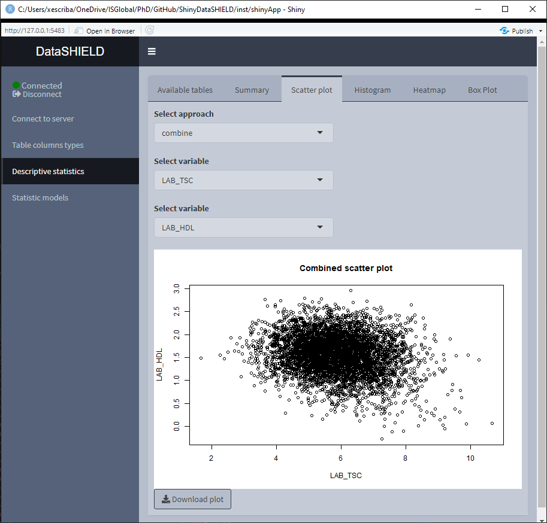
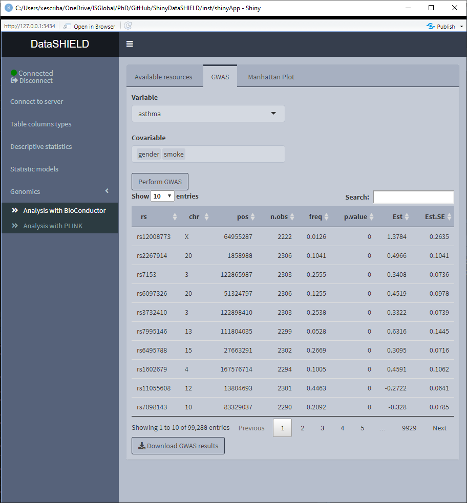
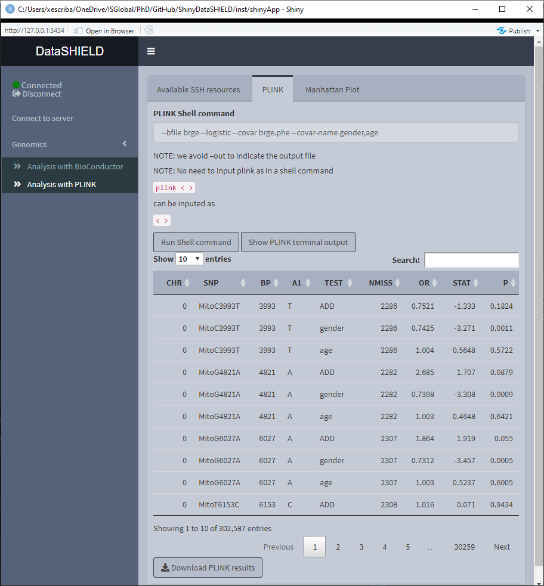
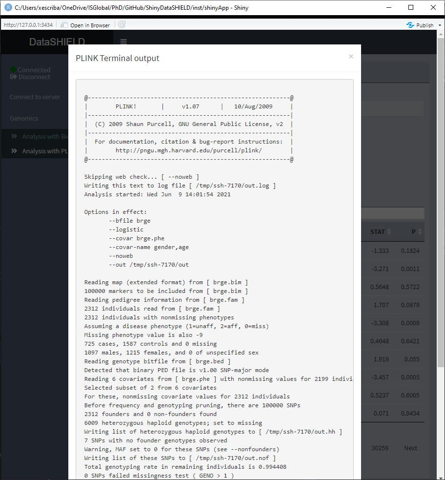

# Functionalities

Along this section, an overview of the functionalities implemented on ShinyDataSHIELD is given. There's information about how to use the funcionalities as well as some limitations or constraints to take into account when using ShinyDataSHIELD.

## Data entry

| `r emo::ji("warning")` DISCLAIMER          |
|:---------------------------|
| Along this section the terms **table** and **resource** are widely used, it is important noting that when the autor talks about a table, it refers to what is shown as a table on the Opal server. A resource that holds a table is called (and treated) as a resource.      |

The first step to any analysis is to load the required tables or resources to the study server(s). To do so, the user has to provide the server URL and the login credentials. This will allow the application to connect to the OPAL server and retrieve all the projects and resources / tables from them. Afterwards, the user can select the desired resources / tables and load them to the study servers.

There are some limitations to how the data entry is coded in ShinyDataSHIELD:

 + When loading multiple tables / resources on a study server, it is assumed only tables are selected or only resources, not combined.
 + When dealing with tables, there can only be one table per study.
 + A pooled study can only contain one table (or resource) per study server.
 + When performing a pooled study, consistency among the tables is assumed, meaning all tables share the same columns.
 + When loading multiple resources per study server, only one study is allowed.
 
The limitations can be overcome by changing the part of the code in charge of the data entry. Look at the developers guide flowcharts to get some references on which parts of the code could be altered to change the current limitations.

When loged into the Opal server, the interface shows two selectors, one is a dropdown with all the projects found on the server, the other is a dropdown (with multiple selection) with the resources / tables inside the selected project. The user has to select the project and resource(s) / table(s) that wants to load on a study server and press the "Add study" button.

Below the two selectors a table will be shown, on this table each line corresponds to a study server. If the user made a mistake when adding a study server, the rows on this table can be selected, and by pressing the "Remove selected study" button, the selected study servers will be removed.

When the desired study serveres are selected, press the "Connect" button to connect to them.

Following the limitations explained before, there are three different use cases.

### Single resource / table approach

To perform analysis on data that is contained on a single resource / table of the server, the user has to select it from the dropdown inputs, add it to the study and connect to it.

### Multiple resource study

Some studies require to put more than one resource on a study server, this is the case for example of using VCF files to perform a GWAS; they require two resources, the VCF resource and the covariates resource (which is a resource that holds a plain table). For this use case, the user has to select the multiple resources from the dropdown inputs, add them to a single study and connect to it.

### Pooled data approach

Some studies have the data distributed across multiple tables or resources that need to be pooled to perform a study. To load this kind of studies, the user has to select each different table / resource, add it to a study separately and connect to it.

## Descriptive statistics

The descriptive statistics functionality is available for tables as well as the following resource types:

  + SQL tables
  + Tidy data files (tables): `*.csv`, `*.tsv`, etc
  + ExpressionSets
  + RangedSummarizedExperiments
  
When using pooled data the descriptive statistics is by default of the pooled data, however, the graphical visualizations included on descriptive statistics provide the option of showing separated plots for the different studies.

The download button will prompt a system window to select where to store the shown table, it will save it as a `*.csv`.
  
### Summary

The summary provides non-disclosive insights on the different variables of the loaded data. This functionality is only available for factors and numeric variables, otherwise no table will be rendered. When the desired summary is disclosive no table will be shown (as the function call returns an Error stating that the the return is disclosive).

When the selected variable is a factor, the output shown is a count of all the different factors.

When the selected variable is numerical, the output shown is a quantiles and mean table.

### Scatter plot

Create a non-disclosive scatter plot by selecting two numerical variables (one for each axis). There's the option of obtaining a pooled data plot or a different plot for each study server. The selected variables have to be numerical, otherwise the plot is not displayed and a warning message appears.

The dowload plot button saves the shown figure as a `*.png`.

### Histogram

Create a non-disclosive histogram of a selected variable. There's the option of obtaining a pooled data plot or a different plot for each study server. The selected variable has to be numerical, otherwise the plot is not displayed and a warning message appears.

The dowload plot button saves the shown figure as a `*.png`.

### Heatmap

Create a non-disclosive heatmap plot by selecting two numerical variables (one for each axis). There's the option of obtaining a pooled data plot or a different plot for each study server. The selected variables have to be numerial, otherwise the plot is not displayed and a warning message appears.

The dowload plot button saves the shown figure as a `*.png`.

## Statistic models

Statistic models are available for tables as well as the following resource types:

  + SQL tables
  + Tidy data files (tables): `*.csv`, `*.tsv`, etc
<!--   + ExpressionSets -->
<!--   + RangegSummarizedExperiments -->

<!-- This corresponds to the same options as the descriptive statistics, so as a rule of thumb if you can perform descriptive statistics on it you can also fit statistic models. -->

<!-- When using pooled data, the models will be fitted to the pooled data, there's no option implemented to fit a model for each study. -->

There are two different statisticals models available to fit, GLM models (Statistics models tab) and GLMer models (Mixed statistical models tab).

### GLM models

The tab to fit a non-disclosive generalized linear models (GLM) contains a box to manually input the formula, a selector for the output family and a table displaying the variables of the data and the type of each variable. The possible output families are:

 + Gaussian
 + Poisson
 + Binomial

There's some help built into ShinyDataSHIELD regarding how to write the GLM formula, which is prompted to the user when clicking on the "Formula input help" button. The display of the variables can be toggled on and off for the convenience of use.

Once the GLM model is fitted a table below the variables display will be rendered with the model results. The download button will prompt a system window to select where to store the shown table, it will save it as a `*.csv`.

When using pooled data, the results of the GLM model will be of the combined data.

(To do: Display more information of why a model fitment fails)

### Mixed models

The tab to fit non-disclosive generalized mixed effects models (GLMer) contains a box to manually input the formula, a selector for the output family and a table displaying the variables of the data and the type of each variable. The possible output families are:

 + Poisson
 + Binomial
 
There's some help built into ShinyDataSHIELD regarding how to write the GLMer formula, which is prompted to the user when clicking on the "Formula input help" button. The display of the variables can be toggled on and off for the convenience of use.

Once the GLMer model is fitted a table below the variables display will be rendered displaying the results. The download button will prompt a system window to select where to store the shown table, it will save them as a `*.csv`.

The mixed model results are independent for each study server. There's a selector to toggle between the results of the different study servers.

(To do: Display more information of why a model fitment fails)

## Genomics

Inside the genomics tab of dsOmicshiny there are two subtabs, one to perform analysis using BioConductor methods and another to perform analysis using PLINK methods. 

### Analysis with BioConductor

To perform non-disclosive genomic analysis using BioConductor methodologies, the user has to input a VCF resource with a covariates resource (table) on the same study.

When performing this kind of analysis, as explained on the Data Entry section, only one study server can be used.

The Analysis with BioConductor has two sub-tabs, the first one corresponds to the GWAS, and as the name implies is used to perform a GWAS (Genome wide association study) non-disclosive analysis on the loaded data. There is a selector for the condition and the covariates to adjusted for. The fitted model is: snp ~ condition + covar1 + ... + covarN. The results of the model appear on a table below the selectors. The download button will prompt a system window to select where to store the shown table, it will save it as a `*.csv`. The second subtab is to display a Manhattan plot of the GWAS results. The dowload plot button saves the shown figure as a `*.png`.

### Analysis with PLINK

To perform non-disclosive analysis using [PLINK](http://zzz.bwh.harvard.edu/plink/index.shtml) commands, the user has to load a SSH resource. The tab contains a field to input the PLINK command and a brief memo stating that when inputing the PLINK command to run there is no need of inputting it as `plink ...` as would be done on a terminal interface, the user has to input just the `...`; also, there is no need to put `–out` to indicate the output file.

Once the command is run, a table with the results is displayed under the command input, the download button will prompt a system window to select where to store the shown table, it will save them as a `*.csv`. A button to display the raw terminal output appears to display the user on a popup the plain text.

There's also a sub-tab to show a Manhattan plot with the results obtained. The dowload plot button saves the shown figure as a `*.png`.

## Omics

On the Omics tab there are three different subtabs for different methodologies to perform non-disclosive analysis: limma, DESeq and edgeR. The resources that can be used are ExpressionSets and RangegSummarizedExperiments. If the resources are pooled the user has to input each one in a different study on the data entry.

### LIMMA

The limma non-disclosive analysis tab contains two selectors to select the condition and covariables of the analysis (resulting formula is: feature ~ condition + covar1 + ... + covarN), there's also a selector to input the annotations columns desired on the output of the analysis. Finally, there's a selector to indicate the type of data that is being studied, whether is microarray or RNAseq. There's a selector to choose to do a surrogate variable analysis.

Once the analysis is performed a table with the results is displayed below the parameter selectors. The download button will prompt a system window to select where to store the shown table, it will save them as a `*.csv`.

If the analysis is being performed usging a pooled dataset, the shown table corresponds to all the pooled data.

  
### DESeq

### edgeR