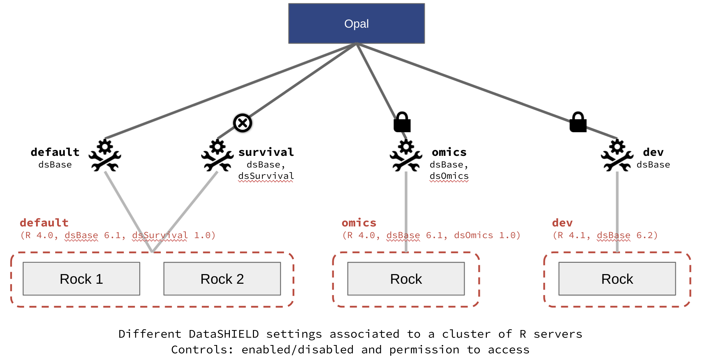
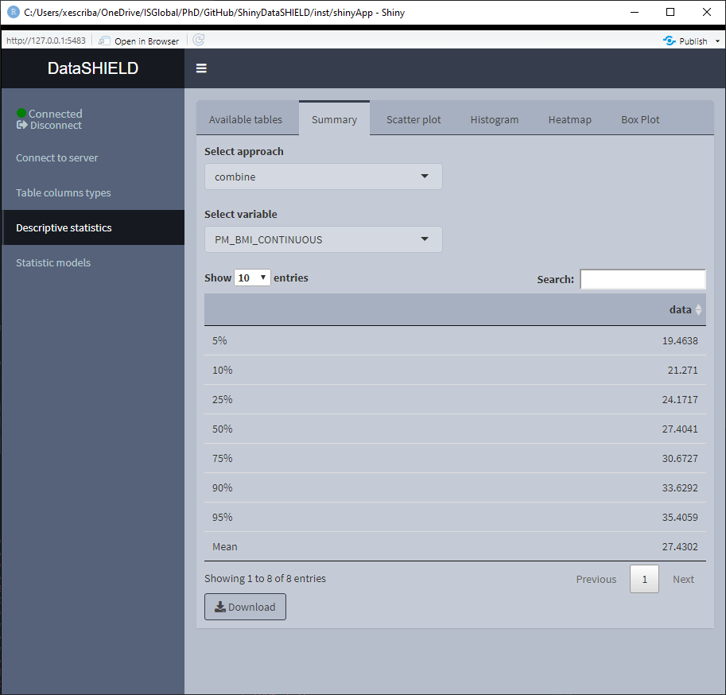
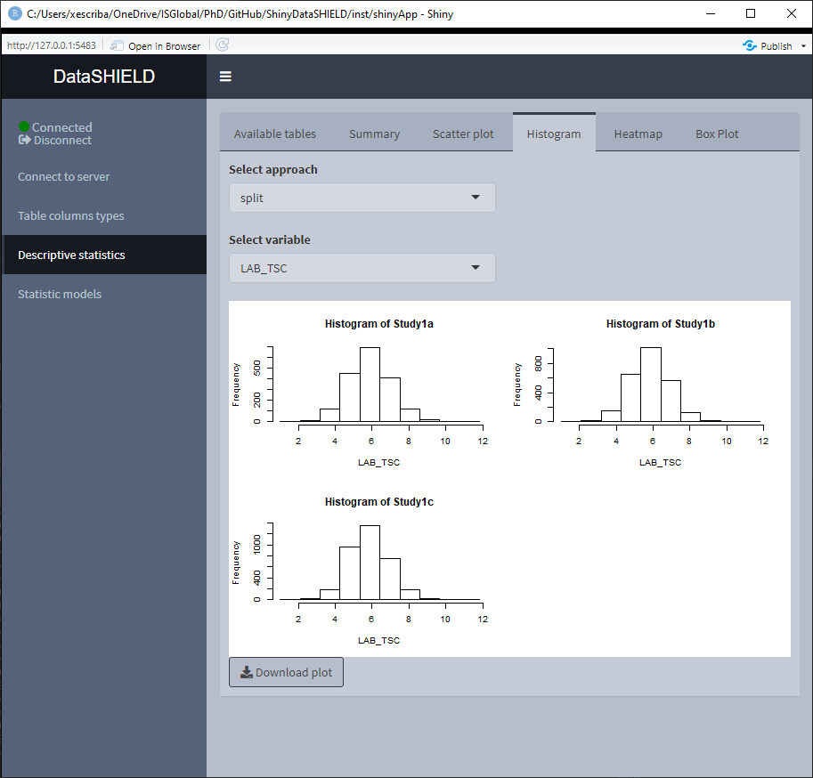
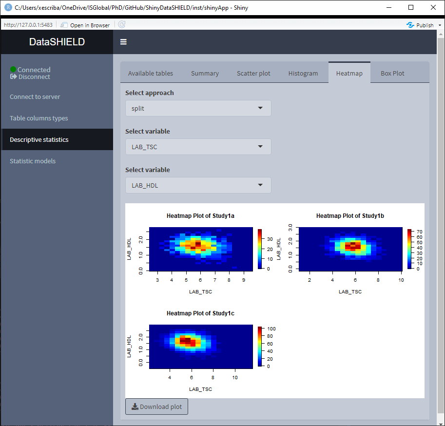
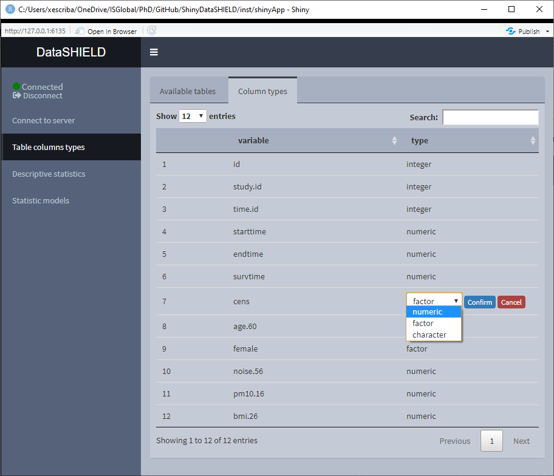

# Functionalities

Along this section, an overview of the functionalities implemented on ShinyDataSHIELD is given. There's information about how to use the funcionalities as well as some limitations or constraints to take into account when using ShinyDataSHIELD.

## Data entry

| `r emo::ji("warning")` DISCLAIMER                                                                                                                                                                                                                                       |
|:------------------------------------------------------------------------------------------------------------------------------------------------------------------------------------------------------------------------------------------------------------------------|
| Along this section the terms **table** and **resource** are widely used, it is important noting that when the autor talks about a table, it refers to what is shown as a table on the Opal server. A resource that holds a table is called (and treated) as a resource. |

The first step to any analysis is to load the required tables or resources to the study server(s). To do so, the user has to provide the server URL and the login credentials. This will allow the application to connect to the OPAL server and retrieve all the projects and resources / tables from them. Afterwards, the user can select the desired resources / tables and load them to the study servers.

It is very important to understand the difference between a server (OPAL server) and a study server (R instances running inside an OPAL server), a study server can be visualized as an R session that has some tables and resources loaded. For that reason we can have multiple study servers on a single OPAL server, which is indeed needed when performing pooled studies.

To properly explain how to load the desired study servers for multiple types of analysis, let's do a guided tour of the interface.

Since Opal 4.2 there is a new concept introduced called `profiles` which correspond to different R servers ([rockr](https://rockdoc.obiba.org/en/latest/)). The user can choose which profile to use for each study server (more info [here](#profiles)).

```{r dataentry1, echo=FALSE, fig.cap="Connect to server, initial state", fig.align='center'}
knitr::include_graphics("images/data_entry1.png")
```

On Figure \@ref(fig:dataentry1) the initial state of the *Connect to server* tab is shown, here we can see some credentials are already inputted, which correspond to a demo server. There is the option of performing a login to the server via traditional user/pass or using personal access token [PAT].

```{r dataentry2, echo=FALSE, fig.cap="Connect to server, selecting tables and resources", fig.align='center'}

```

Once connected to the server, the interface is actualized showing the available projects that contain tables inside. To show the projects that contain resources, just click on the *Table* toggle. An example is illustrated on Figure \@ref(fig:dataentry2).

If we want to get further information from a table(s) or resource(s), select them and click on the *Further information of selection*, this will open the OPAL UI on a browser and will display the associated page for the selected items. If more than one item is selected, a page for each one will be opened. An example of this functionality is shown on the Figure \@ref(fig:dataentry3) where a table was selected to retrieve further information.

```{r dataentry3, echo=FALSE, fig.cap="OPAL UI with information from a table", fig.align='center'}
knitr::include_graphics("images/data_entry3.png")
```

Knowing which items are of our interest, we can add them to be loaded on the study servers, to do that select the items and click *Add selected item(s)*. A new table will appear underneath showing everything selected, illustrated on Figure \@ref(fig:dataentry4). On this table all the elements from all the servers will be added to have the general picture of what will be available on the study servers.

```{r dataentry4, echo=FALSE, fig.cap="Connect to server, selected items", fig.align='center'}
knitr::include_graphics("images/data_entry4.png")
```

Reached this point, let's see different use cases and how we have to configure the application for them.

### Single resource / table approach

Not much to say about this, just select it and click the *Connect* button.

```{r dataentry5, echo=FALSE, fig.cap="Connect to server. Single resource / table approach", fig.align='center'}
knitr::include_graphics("images/data_entry5.png")
```

### Multiple resource study

Some studies require to put more than one resource on a single study server, this is the case of using VCF files to perform a GWAS; they require two resources, the VCF resource and the covariates resource (which is a resource that holds a plain table). For this use case, the user has to select the multiple resources from the dropdown inputs, add them to a single study and connect to it. Two important things must be said for this use case, 1) By default the tables/resources from one server are added to the same study server; 2) to have tables/resources on the same study server, they have to be from the same server, this translates to: we can't put a table from server X and a resource from server Y on the same study server.

```{r dataentry6, echo=FALSE, fig.cap="Connect to server. Single resource / table approach", fig.align='center'}
knitr::include_graphics("images/data_entry6.png")
```

### Pooled data from the same server

It is not uncommon that the same OPAL server has multiple tables that we wish to analyze using a pooled approach. To perform this kind of analysis we have to select all the tables (they have to consistent column-wise to be pooled). The important thing to take into account is that the tables need to be on different study servers in order to be analyzed using a pooled approach, in order to achieve that the user has to double click on the cells in order to edit them (Figure \@ref(fig:dataentry7)). There are a couple of rules regarding the naming of the study servers, 1) User inputted names can't be of the format `StudyX` (where X is a number), and 2) Similarly to what has been stated before, items from different servers can't be on the same study server.

```{r dataentry7, echo=FALSE, fig.cap="Connect to server. Study server edit", fig.align='center'}

```

```{r dataentry8, echo=FALSE, fig.cap="Connect to server. Pooled data from the same server approach", fig.align='center'}
knitr::include_graphics("images/data_entry8.png")
```

### Pooled data from different servers

When pooling data from different servers, we have to separately login to all of them. On the upper part of the interface there is a *+* symbol used to add a new server (Figure \@ref(fig:dataentry9)), when clicking the *-* symbol the last server added will be removed from the interface. The procedure is exactly the same as what we've already seen, the only difference is that on the table of selected items, we will now see items from different servers (Figure \@ref(fig:dataentry10)). Since by default items from different servers are added to different study servers, there is no need to manually configure that.

```{r dataentry9, echo=FALSE, fig.cap="Connect to server. New server", fig.align='center'}
knitr::include_graphics("images/data_entry9.png")
```

```{r dataentry10, echo=FALSE, fig.cap="Connect to server. Pooled data from different servers approach", fig.align='center'}

```

### Study server profiles {#profiles}

Extracted from the [official documentation](https://opaldoc.obiba.org/en/latest/admin/rserver.html): "A DataSHIELD profile is a R server profile combined with a DataSHIELD configuration (allowed functions, options and permissions). DataSHIELD users can then decide in which environment their analysis are to be performed, for a better reproducible science.". On the opal-demo site, there is a different array of profiles, illustrated on the Figure \@ref(fig:opal-profiles).

```{r opal-profiles, echo=FALSE, fig.cap="Opal demo profiles. Extracted from https://opaldoc.obiba.org/", fig.align='center'}

```

In ShinyDataSHIELD, there is the option of assigning the required profile to each study server, there is only one requirement to be taken into account: A study server can only have one distinct profile. So the configuration table of Figure \@ref(fig:opal-profiles1) is valid, and the configuration table of Figure \@ref(fig:opal-profiles2) will yield a connection error (Figure \@ref(fig:opal-profiles3)).

```{r opal-profiles1, echo=FALSE, fig.cap="Correct profiles configuration", fig.align='center'}
knitr::include_graphics("images/opal-datashield-profiles1.png")
```

```{r opal-profiles2, echo=FALSE, fig.cap="Incorrect profiles configuration", fig.align='center'}
knitr::include_graphics("images/opal-datashield-profiles2.png")
```

```{r opal-profiles3, echo=FALSE, fig.cap="Incorrect profiles configuration error message", fig.align='center'}
knitr::include_graphics("images/opal-datashield-profiles3.png")
```

## Table column types

<table><colgroup><col style="width: 100%" /></colgroup><thead><tr class="header"><th style="text-align: left;"><p>`r emo::ji("warning")` TABLES USED TO DEMO THIS SECTION</p></th></tr></thead><tbody><tr class="odd"><td style="text-align: left;"><p>From <a href="https://opal-demo.obiba.org/">https://opal-demo.obiba.org/</a> :</p></td></tr><tr class="even"><td style="text-align: left;"><table><thead><tr class="header"><th><p>STUDY</p></th><th><p>TABLE</p></th><th><p>PROFILE</p></th></tr></thead><tbody><tr class="odd"><td><p>Study1a</p></td><td><p>CNSIM.CNSIM1</p></td><td><p>default</p></td></tr><tr class="even"><td><p>Study1b</p></td><td><p>CNSIM.CNSIM2</p></td><td><p>default</p></td></tr><tr class="odd"><td><p>Study1c</p></td><td><p>CNSIM.CNSIM3</p></td><td><p>default</p></td></tr></tbody></table></td></tr></tbody></table>

The table column types functionality is available for tables as well as the following resource types:

-   SQL tables
-   Tidy data files (tables): `*.csv`, `*.tsv`, etc

All of the above options will be shown on the table that shows the available tables to use on this module. As stated on the use cases, to perform a pooled analysis the tables have to be on different study servers. Column integrity is checked before allowing the user the access to the other tabs.

The function of this module is to get information about the class of each column of a table.

```{r tableclass1, echo=FALSE, fig.cap="Classes of the CNSIM table", fig.align='center'}
knitr::include_graphics("images/table_columns_1.png")
```

Aside from that, there's the option of changing the class of a column. This transformation is done using the proper DataSHIELD functions that perform disclosive checks before allowing the transformation. This is specially important for transformation from numeric to factor for example.

The allowed classes to perform transformations are:

-   Character
-   Numeric
-   Factor

To perform a class change, double click on the desired row and and a drop-down menu will appear, choose the new class and click 'Confirm', after the checks, the table will be updated to display the new class.

```{r tableclass2, echo=FALSE, fig.cap="Class change", fig.align='center'}
knitr::include_graphics("images/table_columns_2.png")
```

Integer could be added if it was of interest. Please [file an issue on GitHub](https://github.com/isglobal-brge/ShinyDataSHIELD/issues) if that is the case.

## Descriptive statistics

<table><colgroup><col style="width: 100%" /></colgroup><thead><tr class="header"><th style="text-align: left;"><p>`r emo::ji("warning")` TABLES USED TO DEMO THIS SECTION</p></th></tr></thead><tbody><tr class="odd"><td style="text-align: left;"><p>From <a href="https://opal-demo.obiba.org/">https://opal-demo.obiba.org/</a> :</p></td></tr><tr class="even"><td style="text-align: left;"><table><thead><tr class="header"><th><p>STUDY</p></th><th><p>TABLE</p></th><th><p>PROFILE</p></th></tr></thead><tbody><tr class="odd"><td><p>Study1a</p></td><td><p>CNSIM.CNSIM1</p></td><td><p>default</p></td></tr><tr class="even"><td><p>Study1b</p></td><td><p>CNSIM.CNSIM2</p></td><td><p>default</p></td></tr><tr class="odd"><td><p>Study1c</p></td><td><p>CNSIM.CNSIM3</p></td><td><p>default</p></td></tr></tbody></table></td></tr></tbody></table>

The descriptive statistics functionality is available for tables as well as the following resource types:

-   SQL tables
-   Tidy data files (tables): `*.csv`, `*.tsv`, etc

All of the above options will be shown on the table that shows the available tables to use on this module. As stated on the use cases, to perform a pooled analysis the tables have to be on different study servers. Column integrity is checked before allowing the user the access to the other tabs.

When using pooled data the descriptive statistics is by default of the pooled data, however, the graphical visualizations included on descriptive statistics provide the option of showing separated plots for the different studies.

### Summary

The summary provides non-disclosive insights on the different variables of the loaded data. This functionality is only available for factors and numeric variables, only variables that meet this criteria will be on the selector. When the desired summary is disclosive no table will be shown (as the function call returns an Error stating that the the return is disclosive).

When the selected variable is a factor, the output shown is a count of all the different factors. It can be visualized with the pooled data or divided by study servers.

<center>


</center>

<center>


</center>

When the selected variable is numerical, the output shown is a quantiles and mean table. It can be visualized with the pooled data or divided by study servers.

<center>



</center>

<center>


</center>

### Scatter plot

Create a non-disclosive scatter plot by selecting two numerical variables (one for each axis). This type of plot can only be generated using numerical variables, for that reason variables that do not meet this criteria are not shown on the selector. It can be visualized with the pooled data or divided by study servers.

<center>


</center>

<center>


</center>

### Histogram

Create a non-disclosive histogram of a selected variable. This type of plot can only be generated using numerical variables, for that reason variables that do not meet this criteria are not shown on the selector. It can be visualized with the pooled data or divided by study servers.

<center>


</center>

<center>



</center>

### Heatmap

Create a non-disclosive heatmap plot by selecting two numerical variables (one for each axis). This type of plot can only be generated using numerical variables, for that reason variables that do not meet this criteria are not shown on the selector. It can be visualized with the pooled data or divided by study servers.

<center>


</center>

<center>



</center>

### Boxplot

Create a non-disclosive Boxplot by selecting as many numerical variables as desired. This plot has the option of performing groupings using one or two factor variables from the same table. It can be visualized with the pooled data or divided by study servers.

<center>


</center>

<center>


</center>

<center>


</center>

<center>


</center>

The Boxplot functionality uses `ggplot2`; a novel in-app editor named `ggEditLite` has been introduced inside the Shiny application to allow simple graphic modifications of the plot to adapt it to the style of choice, add title, subtitle, etc. This feature will be rolled out to all the plots as they get upgraded to make use of the `ggplot2` package.

<center>


</center>

## Statistic models

<table><colgroup><col style="width: 100%" /></colgroup><thead><tr class="header"><th style="text-align: left;"><p>`r emo::ji("warning")` TABLES USED TO DEMO THIS SECTION</p></th></tr></thead><tbody><tr class="odd"><td style="text-align: left;"><p>From <a href="https://opal-demo.obiba.org/">https://opal-demo.obiba.org/</a> :</p></td></tr><tr class="even"><td style="text-align: left;"><p>GLM and mixed models</p><table><thead><tr class="header"><th><p>STUDY</p></th><th><p>TABLE</p></th><th><p>PROFILE</p></th></tr></thead><tbody><tr class="odd"><td><p>Study1a</p></td><td><p>CNSIM.CNSIM1</p></td><td><p>default</p></td></tr><tr class="even"><td><p>Study1b</p></td><td><p>CNSIM.CNSIM2</p></td><td><p>default</p></td></tr><tr class="odd"><td><p>Study1c</p></td><td><p>CNSIM.CNSIM3</p></td><td><p>default</p></td></tr></tbody></table></td></tr><tr class="odd"><td style="text-align: left;"><p>Survival analysis</p><table><thead><tr class="header"><th><p>STUDY</p></th><th><p>TABLE</p></th><th><p>PROFILE</p></th></tr></thead><tbody><tr class="odd"><td><p>Study1a</p></td><td><p>SURVIVAL.EXPAND_WITH_MISSING1</p></td><td><p>survival</p></td></tr><tr class="even"><td><p>Study1b</p></td><td><p>SURVIVAL.EXPAND_WITH_MISSING2</p></td><td><p>survival</p></td></tr><tr class="odd"><td><p>Study1c</p></td><td><p>SURVIVAL.EXPAND_WITH_MISSING3</p></td><td><p>survival</p></td></tr></tbody></table></td></tr></tbody></table>

Statistic models are available for tables as well as the following resource types:

-   SQL tables
-   Tidy data files (tables): `*.csv`, `*.tsv`, etc

<!-- This corresponds to the same options as the descriptive statistics, so as a rule of thumb if you can perform descriptive statistics on it you can also fit statistic models. -->

There are three different statisticals models available to fit, GLM models (Statistics models tab), GLMer models (Mixed statistical models tab) and Survival cox models (Survival analysis tab).

### GLM models

The tab to fit a non-disclosive generalized linear models (GLM) contains a box to manually input the formula, a selector for the output family and a table displaying the variables of the data and the type of each variable. There is finally the option to perform a pooled analysis or a meta-study. The possible output families are:

-   Gaussian
-   Poisson
-   Binomial

There's some help built into ShinyDataSHIELD regarding how to write the GLM formula, which is prompted to the user when clicking on the "Formula input help" button. The display of the variables can be toggled on and off for the convenience of use.

Once the GLM model is fitted a table below the variables display will be rendered with the model results. The download button will prompt a system window to select where to store the shown table, it will save it as a `*.csv`.

When using pooled data, the results of the GLM model will be of the combined data.

(To do: Display more information of why a model fitment fails)

<center>


</center>

When using a meta-study approach the results correpond to the betas and standard errors for three different meta study methodologies:

-   Maximum Likelihood
-   REstricted Maximum Likelihood
-   Fixed-Effects meta-analysis

This three methodologies can be visualized on a forest plot by selecting the desired one.

<center>


</center>

### Mixed models

The tab to fit non-disclosive generalized mixed effects models (GLMer) contains a box to manually input the formula, a selector for the output family and a table displaying the variables of the data and the type of each variable. The possible output families are:

-   Poisson
-   Binomial

There's some help built into ShinyDataSHIELD regarding how to write the GLMer formula, which is prompted to the user when clicking on the "Formula input help" button. The display of the variables can be toggled on and off for the convenience of use.

Once the GLMer model is fitted a table below the variables display will be rendered displaying the results. The download button will prompt a system window to select where to store the shown table, it will save them as a `*.csv`.

The mixed model results are independent for each study server. There's a selector to toggle between the results of the different study servers.

(To do: Display more information of why a model fitment fails)

<center>


</center>

### Survival Analysis

The tab to fit non-disclosive survival analysis is divided into four different subtabs. The first subtab, is used to create a survival object (See the information about `survival::Surv` function for more information <https://www.rdocumentation.org/packages/survival/versions/2.11-4/topics/Surv>). To create this object, three columns from the selected tables are needed and a parameter:

(Information about each column copied from the `survival::Surv` function documentation)

-   Start time variable: for right censored data, this is the follow up time. For interval data, the first argument is the starting time for the interval.
-   End time variable: ending time of the interval for interval censored or counting process data only. Intervals are assumed to be open on the left and closed on the right, `(start, end]`. For counting process data, event indicates whether an event occurred at the end of the interval.
-   Event variable: The status indicator, normally 0=alive, 1=dead. Other choices are `TRUE/FALSE` (`TRUE` = death) or 1/2 (2=death). For interval censored data, the status indicator is 0=right censored, 1=event at `time` (Start time variable), 2=left censored, 3=interval censored. For multiple enpoint data the event variable will be a factor, whose first level is treated as censoring. Although unusual, the event indicator can be omitted, in which case all subjects are assumed to have an event.
-   Type of censoring (parameter): character string specifying the type of censoring. Possible values are "`right`", "`left`", "`counting`", "`interval`", "`interval2`" or "`mstate`".

For the data used on this demo, the columns are the following:

-   Start time variable: `starttime`
-   End time variable: `endtime`
-   Event variable: `cens`
-   Type of censoring (parameter): `counting`

We have to make sure all three columns are numeric on this demo:

<center>



</center>

<center>


</center>

Once the survival object is created, the tab 'Fit survival model' is unlocked. On this tab, as with the other statistic models, there is a help button and a 'Toggle variables tables' to visualize the variables available to construct the model. The formula has the following structure:

`survival_object~tables_sm$variable+tables_sm$variable2`

Where `survival_object` and `tables_sm` can't be modified. An example model for this demo data would be:

`survival_object~tables_sm$age+tables_sm$female`

<center>


</center>

If a model is fitted, the left two tabs can be accessed, this two tabs correspond to two possible visualization options of the survival analysis. The 'Meta analysis' plots a forestplot of a selected model variable using different meta-analysis methods. The 'Visualization of model' plots the survival curves for each study server.

<center>


</center>

<center>


</center>

## Genomics

<table><colgroup><col style="width: 100%" /></colgroup><thead><tr class="header"><th style="text-align: left;"><p>`r emo::ji("warning")` RESOURCES USED TO DEMO THIS SECTION</p></th></tr></thead><tbody><tr class="odd"><td style="text-align: left;"><p>From <a href="https://opal-demo.obiba.org/">https://opal-demo.obiba.org/</a> :</p></td></tr><tr class="even"><td style="text-align: left;"><p>Analysis with BioConductor</p><table><thead><tr class="header"><th><p>STUDY</p></th><th><p>RESOURCE</p></th><th><p>PROFILE</p></th></tr></thead><tbody><tr class="odd"><td><p>Study1</p></td><td><p>RSRC.brge</p></td><td><p>omics</p></td></tr><tr class="even"><td><p>Study1</p></td><td><p>RSRC.brge_vcf</p></td><td><p>omics</p></td></tr></tbody></table></td></tr><tr class="odd"><td style="text-align: left;"><p>Analysis with PLINK</p><table><thead><tr class="header"><th><p>STUDY</p></th><th><p>RESOURCE</p></th><th><p>PROFILE</p></th></tr></thead><tbody><tr class="odd"><td><p>Study1</p></td><td><p>RSRC.brge_plink</p></td><td><p>omics</p></td></tr></tbody></table></td></tr></tbody></table>

Inside the genomics tab of dsOmicshiny there are two subtabs, one to perform analysis using BioConductor methods and another to perform analysis using PLINK methods.

### Analysis with BioConductor

To perform non-disclosive genomic analysis using BioConductor methodologies, the user has to input a VCF resource with a covariates resource (table) on the same study.

When performing this kind of analysis, as explained on the Data Entry section, only one study server can be used.

The Analysis with BioConductor has two sub-tabs, the first one corresponds to the GWAS, and as the name implies is used to perform a GWAS (Genome wide association study) non-disclosive analysis on the loaded data. There is a selector for the condition and the covariates to adjusted for. The fitted model is: snp \~ condition + covar1 + ... + covarN. The results of the model appear on a table below the selectors. The download button will prompt a system window to select where to store the shown table, it will save it as a `*.csv`. The second subtab is to display a Manhattan plot of the GWAS results. The dowload plot button saves the shown figure as a `*.png`.

<center>


</center>

<center>


</center>

### Analysis with PLINK

To perform non-disclosive analysis using [PLINK](http://zzz.bwh.harvard.edu/plink/index.shtml) commands, the user has to load a SSH resource. The tab contains a field to input the PLINK command and a brief memo stating that when inputing the PLINK command to run there is no need of inputting it as `plink ...` as would be done on a terminal interface, the user has to input just the `...`; also, there is no need to put `–out` to indicate the output file.

Once the command is run, a table with the results is displayed under the command input, the download button will prompt a system window to select where to store the shown table, it will save them as a `*.csv`. A button to display the raw terminal output appears to display the user on a popup the plain text.

<center>


</center>

<center>


</center>

There's also a sub-tab to show a Manhattan plot with the results obtained. The dowload plot button saves the shown figure as a `*.png`.

<center>


</center>

## Omics

<table><colgroup><col style="width: 100%" /></colgroup><thead><tr class="header"><th style="text-align: left;"><p>`r emo::ji("warning")` RESOURCES USED TO DEMO THIS SECTION</p></th></tr></thead><tbody><tr class="odd"><td style="text-align: left;"><p>From <a href="https://opal-demo.obiba.org/">https://opal-demo.obiba.org/</a> :</p></td></tr><tr class="even"><td style="text-align: left;"><p>LIMMA</p><table><thead><tr class="header"><th><p>STUDY</p></th><th><p>RESOURCE</p></th><th><p>PROFILE</p></th></tr></thead><tbody><tr class="odd"><td><p>Study1</p></td><td><p>RSRC.GSE80970</p></td><td><p>omics</p></td></tr></tbody></table></td></tr><tr class="odd"><td style="text-align: left;"><p>DESeq and edge R: To be determined</p></td></tr></tbody></table>

On the Omics tab there are three different subtabs for different methodologies to perform non-disclosive analysis: limma, DESeq and edgeR. The resources that can be used are ExpressionSets and RangegSummarizedExperiments. If the resources are pooled the user has to input each one in a different study on the data entry.

### LIMMA

The limma non-disclosive analysis tab contains two selectors to select the condition and covariables of the analysis (resulting formula is: feature \~ condition + covar1 + ... + covarN), there's also a selector to input the annotations columns desired on the output of the analysis. Finally, there's a selector to indicate the type of data that is being studied, whether is microarray or RNAseq. There's a selector to choose to do a surrogate variable analysis.

Once the analysis is performed a table with the results is displayed below the parameter selectors. The download button will prompt a system window to select where to store the shown table, it will save them as a `*.csv`.

If the analysis is being performed usging a pooled dataset, the shown table corresponds to all the pooled data.

<center>


</center>

### DESeq

To be implemented.

### edgeR

To be implemented.
